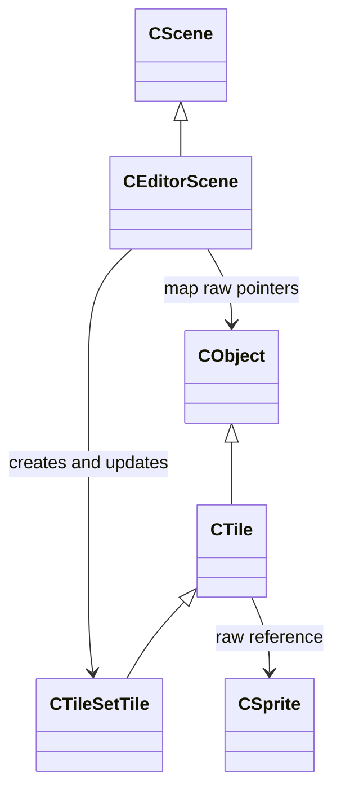

# Auto Tiling

스테이지 에디터에서 인접 타일을 판별하고 Atlas 좌표를 자동 선택하며 주변 타일을 갱신하는 코드입니다.

## 클래스 구조

`<|--` 상속 · `-->` 비소유 사용/참조

## 실행 결과

### 타일 배치와 자동 연결

[타일 배치와 자동 연결 영상 보기](Media/auto-tiling-placement.mp4)

### 인접 타일 갱신

[인접 타일 갱신 영상 보기](Media/auto-tiling-update.mp4)

## 포함 파일

| 구현 단위 | 헤더 | 구현 |
|---|---|---|
| `CTileSetTile` | `Include/CTileSetTile.h` | `Source/CTileSetTile.cpp` |
| `EditorScene` | `Include/EditorScene.h` | `Source/EditorScene.cpp` |
| `Stage` | `Include/Stage.h` | `Source/Stage.cpp` |
| `Tile` | `Include/Tile.h` | `Source/Tile.cpp` |

> 전체 프로젝트의 빌드 의존성은 포함하지 않았으며, 구현 흐름을 확인하는 데 필요한 범위까지만 선별했습니다.
