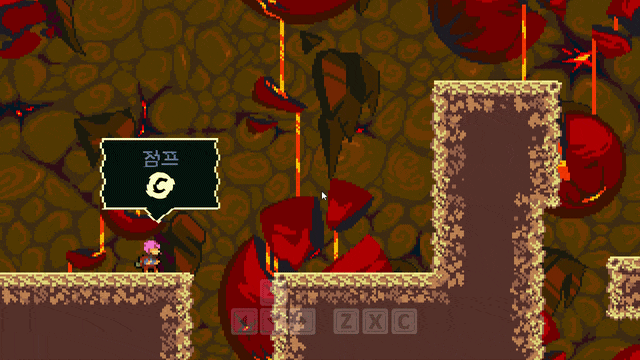

# Locomotion and Hair

플레이어 이동·점프·대시·벽타기와 다관절 머리카락에 사용한 코드입니다.

## 실행 결과

### 로코모션과 머리카락

## 포함 파일

| 구현 단위 | 헤더 | 구현 |
|---|---|---|
| `Hair` | `Include/Hair.h` | `Source/Hair.cpp` |
| `Player` | `Include/Player.h` | `Source/Player.cpp` |

> 전체 프로젝트의 빌드 의존성은 포함하지 않았으며, 구현 흐름을 확인하는 데 필요한 범위까지만 선별했습니다.
