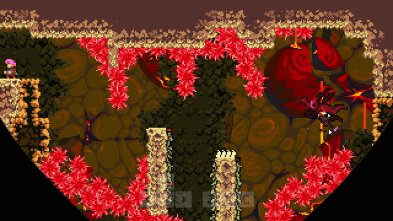

# Theme Gimmicks

테마에 따라 동작이 바뀌는 오브젝트와 보스전 기믹 코드입니다.

## 실행 결과

### 테마 기믹과 보스전

## 포함 파일

| 구현 단위 | 헤더 | 구현 |
|---|---|---|
| `BumpBlock` | `Include/BumpBlock.h` | `Source/BumpBlock.cpp` |
| `BumpBlockManager` | `Include/BumpBlockManager.h` | `Source/BumpBlockManager.cpp` |
| `CLavaBubble` | `Include/CLavaBubble.h` | `Source/CLavaBubble.cpp` |
| `CrystalSpike` | `Include/CrystalSpike.h` | `Source/CrystalSpike.cpp` |
| `FlipSwitch` | `Include/FlipSwitch.h` | `Source/FlipSwitch.cpp` |

> 전체 프로젝트의 빌드 의존성은 포함하지 않았으며, 구현 흐름을 확인하는 데 필요한 범위까지만 선별했습니다.
