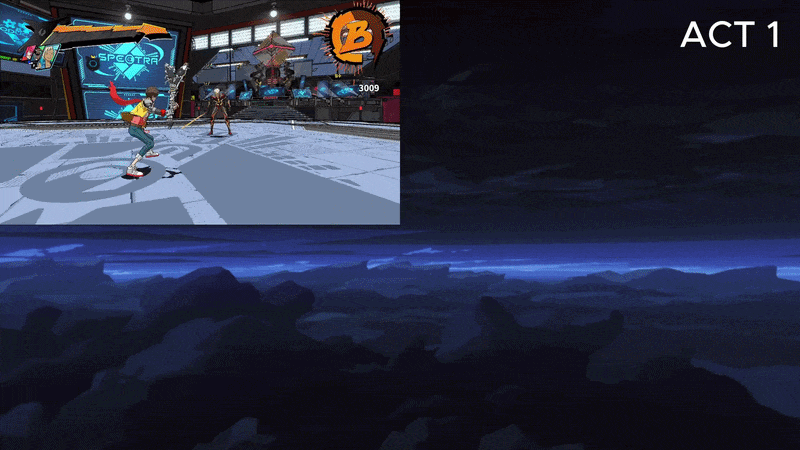

# Script Cutscene

카메라·대사·UI·이펙트·사운드를 Act 단위로 제어하는 컷신 코드입니다.

## 실행 결과

## 포함 파일

| 구현 단위 | 헤더 | 구현 |
|---|---|---|
| `CutScene` | `Include/CutScene.h` | `Source/CutScene.cpp` |
| `CutScene_Value` | `Include/CutScene_Value.h` | — |
| `UC_CutScene` | `Include/UC_CutScene.h` | `Source/UC_CutScene.cpp` |

> 전체 프로젝트의 빌드 의존성은 포함하지 않았으며, 구현 흐름을 확인하는 데 필요한 범위까지만 선별했습니다.
