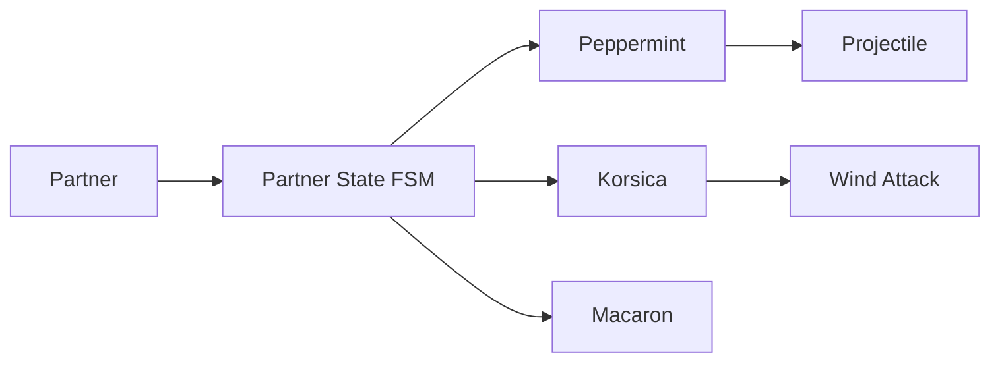

# Partner Combat

페퍼민트·코르시카·마카롱의 일반 공격과 차지 공격에 사용한 코드입니다.

## 구조

## 포함 파일

| 구현 단위 | 헤더 | 구현 |
|---|---|---|
| `FSM_PartnerBattle` | `Include/FSM_PartnerBattle.h` | `Source/FSM_PartnerBattle.cpp` |
| `FSM_PartnerState` | `Include/FSM_PartnerState.h` | `Source/FSM_PartnerState.cpp` |
| `Korsica_Wind` | `Include/Korsica_Wind.h` | `Source/Korsica_Wind.cpp` |
| `Partner` | `Include/Partner.h` | `Source/Partner.cpp` |
| `Partner_Character_Korsica` | `Include/Partner_Character_Korsica.h` | `Source/Partner_Character_Korsica.cpp` |
| `Partner_Character_Macaron` | `Include/Partner_Character_Macaron.h` | `Source/Partner_Character_Macaron.cpp` |
| `Partner_Character_Peppermint` | `Include/Partner_Character_Peppermint.h` | `Source/Partner_Character_Peppermint.cpp` |
| `Projectile_Peppermint_Bullet` | `Include/Projectile_Peppermint_Bullet.h` | `Source/Projectile_Peppermint_Bullet.cpp` |

> 전체 프로젝트의 빌드 의존성은 포함하지 않았으며, 구현 흐름을 확인하는 데 필요한 범위까지만 선별했습니다.
