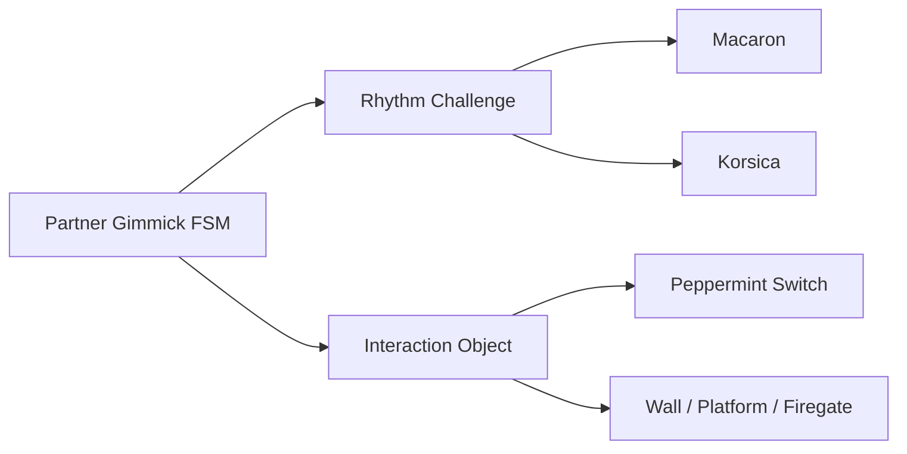

# Partner Gimmicks

세 파트너의 리듬 판정과 상호작용 기믹에 사용한 코드입니다.

## 구조

## 포함 파일

| 구현 단위 | 헤더 | 구현 |
|---|---|---|
| `FSM_PartnerGimmic` | `Include/FSM_PartnerGimmic.h` | `Source/FSM_PartnerGimmic.cpp` |
| `Interact_Korsica_Firegate` | `Include/Interact_Korsica_Firegate.h` | `Source/Interact_Korsica_Firegate.cpp` |
| `Interact_Korsica_PowerPlant` | `Include/Interact_Korsica_PowerPlant.h` | `Source/Interact_Korsica_PowerPlant.cpp` |
| `Interact_Macaron_MonsterShield` | `Include/Interact_Macaron_MonsterShield.h` | `Source/Interact_Macaron_MonsterShield.cpp` |
| `Interact_Macaron_Platform` | `Include/Interact_Macaron_Platform.h` | `Source/Interact_Macaron_Platform.cpp` |
| `Interact_Macaron_Wall` | `Include/Interact_Macaron_Wall.h` | `Source/Interact_Macaron_Wall.cpp` |
| `Interact_Peppermint_Switch` | `Include/Interact_Peppermint_Switch.h` | `Source/Interact_Peppermint_Switch.cpp` |
| `UC_RhythmChallenge_Korsica` | `Include/UC_RhythmChallenge_Korsica.h` | `Source/UC_RhythmChallenge_Korsica.cpp` |
| `UC_RhythmChallenge_Macaron` | `Include/UC_RhythmChallenge_Macaron.h` | `Source/UC_RhythmChallenge_Macaron.cpp` |

> 전체 프로젝트의 빌드 의존성은 포함하지 않았으며, 구현 흐름을 확인하는 데 필요한 범위까지만 선별했습니다.
