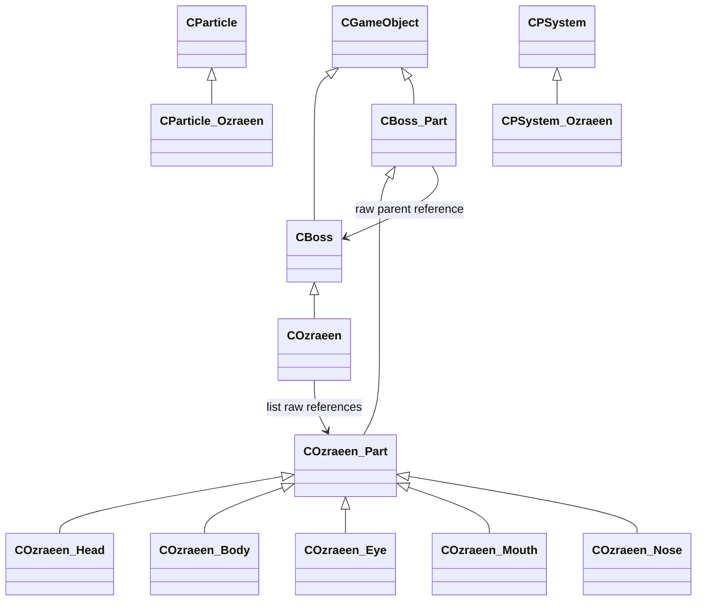
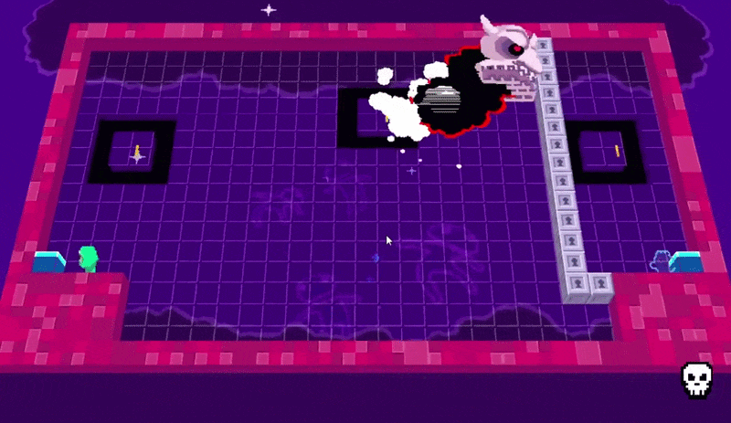

# Boss and Ozraeen

FSM 기반 보스 공통 구조와 Ozraeen 구현 코드입니다.

## 클래스 구조

`<|--` 상속 · `-->` 비소유 참조

## 실행 결과

### Ozraeen 보스전

## 포함 파일

| 구현 단위 | 헤더 | 구현 |
|---|---|---|
| `Boss` | `Include/Boss.h` | `Source/Boss.cpp` |
| `Boss_Part` | `Include/Boss_Part.h` | `Source/Boss_Part.cpp` |
| `Ozraeen` | `Include/Ozraeen.h` | `Source/Ozraeen.cpp` |
| `Ozraeen_Body` | `Include/Ozraeen_Body.h` | `Source/Ozraeen_Body.cpp` |
| `Ozraeen_Eye` | `Include/Ozraeen_Eye.h` | `Source/Ozraeen_Eye.cpp` |
| `Ozraeen_Head` | `Include/Ozraeen_Head.h` | `Source/Ozraeen_Head.cpp` |
| `Ozraeen_Mouth` | `Include/Ozraeen_Mouth.h` | `Source/Ozraeen_Mouth.cpp` |
| `Ozraeen_Nose` | `Include/Ozraeen_Nose.h` | `Source/Ozraeen_Nose.cpp` |
| `Ozraeen_Part` | `Include/Ozraeen_Part.h` | `Source/Ozraeen_Part.cpp` |
| `Particle_Ozraeen` | `Include/Particle_Ozraeen.h` | `Source/Particle_Ozraeen.cpp` |
| `PSystem_Ozraeen` | `Include/PSystem_Ozraeen.h` | `Source/PSystem_Ozraeen.cpp` |

> 전체 프로젝트의 빌드 의존성은 포함하지 않았으며, 구현 흐름을 확인하는 데 필요한 범위까지만 선별했습니다.
