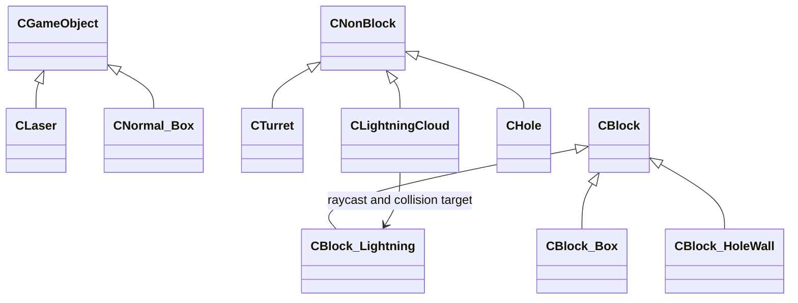

# Gimmick Objects

Laser·Fire Turret·Box·Lightning·Hole 기믹에 사용한 코드입니다.

## 클래스 구조

`<|--` 상속 · `-->` 비소유 사용/참조

## 포함 파일

| 구현 단위 | 헤더 | 구현 |
|---|---|---|
| `Block_Box` | `Include/Block_Box.h` | `Source/Block_Box.cpp` |
| `Block_HoleWall` | `Include/Block_HoleWall.h` | `Source/Block_HoleWall.cpp` |
| `Block_Lightning` | `Include/Block_Lightning.h` | `Source/Block_Lightning.cpp` |
| `Hole` | `Include/Hole.h` | `Source/Hole.cpp` |
| `Laser` | `Include/Laser.h` | `Source/Laser.cpp` |
| `LightningCloud` | `Include/LightningCloud.h` | `Source/LightningCloud.cpp` |
| `Normal_Box` | `Include/Normal_Box.h` | `Source/Normal_Box.cpp` |
| `Turret` | `Include/Turret.h` | `Source/Turret.cpp` |

> 전체 프로젝트의 빌드 의존성은 포함하지 않았으며, 구현 흐름을 확인하는 데 필요한 범위까지만 선별했습니다.
