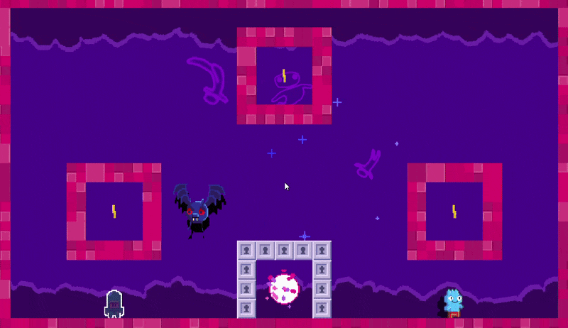

# Bat and Pig

2D 순찰과 3D 추적을 전환하는 박쥐·돼지 몬스터 코드입니다.

## 실행 결과

## 포함 파일

| 구현 단위 | 헤더 | 구현 |
|---|---|---|
| `Monster_Bat` | `Include/Monster_Bat.h` | `Source/Monster_Bat.cpp` |
| `Monster_Pig` | `Include/Monster_Pig.h` | `Source/Monster_Pig.cpp` |

> 전체 프로젝트의 빌드 의존성은 포함하지 않았으며, 구현 흐름을 확인하는 데 필요한 범위까지만 선별했습니다.
