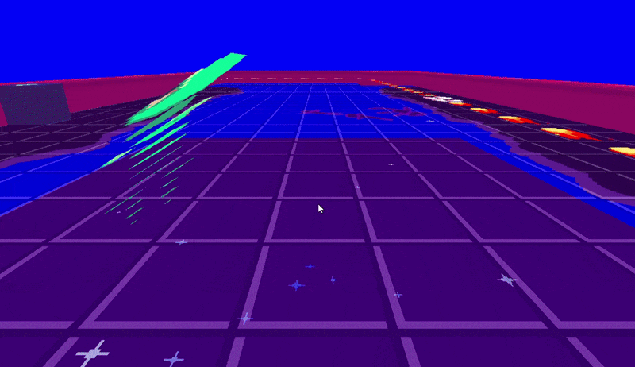

# Sprite Stack

파츠별 깊이와 회전·위치·빌보드를 이용해 2D 스프라이트를 입체화한 코드입니다.

## 실행 결과

## 포함 파일

| 구현 단위 | 헤더 | 구현 |
|---|---|---|
| `Topdee` | `Include/Topdee.h` | `Source/Topdee.cpp` |
| `Topdee_Body` | `Include/Topdee_Body.h` | `Source/Topdee_Body.cpp` |
| `Topdee_Hands` | `Include/Topdee_Hands.h` | `Source/Topdee_Hands.cpp` |
| `Topdee_Legs` | `Include/Topdee_Legs.h` | `Source/Topdee_Legs.cpp` |
| `Topdee_Parts` | `Include/Topdee_Parts.h` | `Source/Topdee_Parts.cpp` |

> 전체 프로젝트의 빌드 의존성은 포함하지 않았으며, 구현 흐름을 확인하는 데 필요한 범위까지만 선별했습니다.
