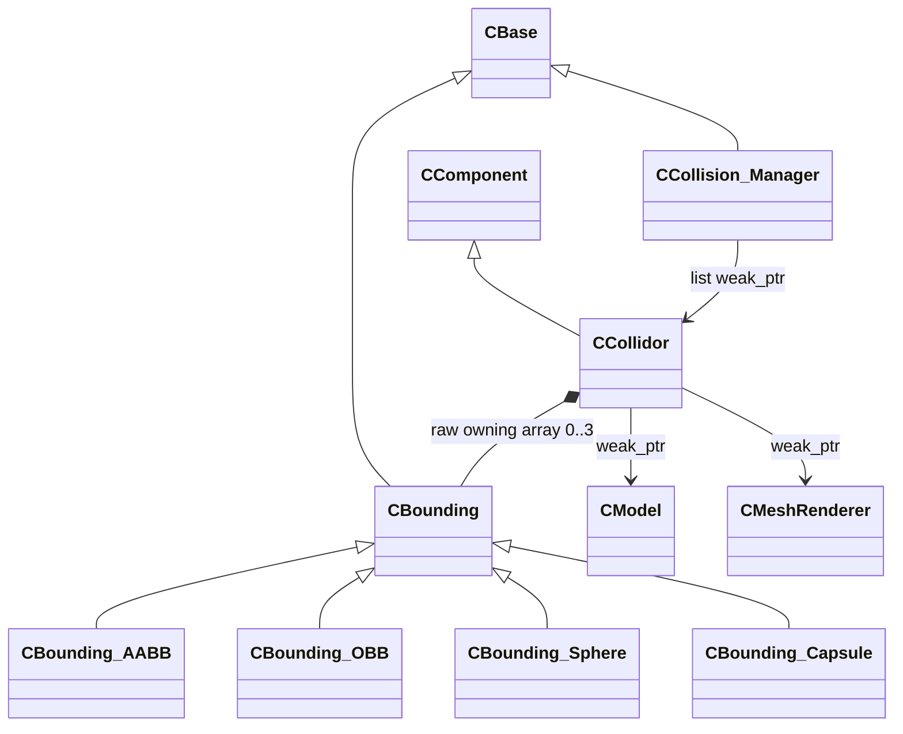

# Collision Manager

콜라이더 등록과 충돌 처리 흐름을 관리합니다.

## 클래스 구조

`<|--` 상속 · `*--` 소유 · `-->` 비소유 참조

## 포함 파일

| 구현 단위 | 헤더 | 구현 |
|---|---|---|
| `Bounding` | `Include/Bounding.h` | `Source/Bounding.cpp` |
| `Bounding_AABB` | `Include/Bounding_AABB.h` | `Source/Bounding_AABB.cpp` |
| `Bounding_Capsule` | `Include/Bounding_Capsule.h` | `Source/Bounding_Capsule.cpp` |
| `Bounding_OBB` | `Include/Bounding_OBB.h` | `Source/Bounding_OBB.cpp` |
| `Bounding_Sphere` | `Include/Bounding_Sphere.h` | `Source/Bounding_Sphere.cpp` |
| `BoundingCapsule` | `Include/BoundingCapsule.h` | `Source/BoundingCapsule.cpp` |
| `Collidor` | `Include/Collidor.h` | `Source/Collidor.cpp` |
| `Collision_Manager` | `Include/Collision_Manager.h` | `Source/Collision_Manager.cpp` |

> 전체 프로젝트의 빌드 의존성은 포함하지 않았으며, 구현 흐름을 확인하는 데 필요한 범위까지만 선별했습니다.
