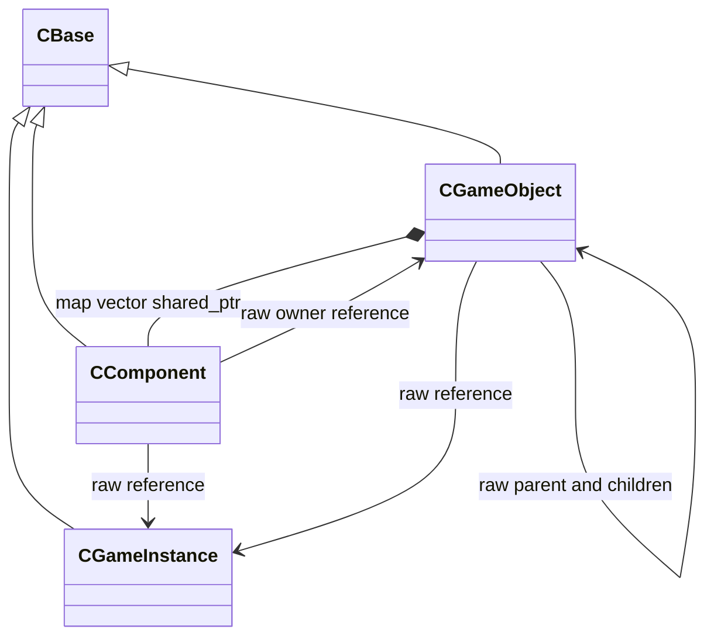

# Object and Component

게임 오브젝트의 생명 주기, 컴포넌트 조합, 생성과 복제의 기반 구조입니다.

## 클래스 구조

`<|--` 상속 · `*--` 소유 · `-->` 비소유 참조

## 포함 파일

| 구현 단위 | 헤더 | 구현 |
|---|---|---|
| `Component` | `Include/Component.h` | `Source/Component.cpp` |
| `GameInstance` | `Include/GameInstance.h` | `Source/GameInstance.cpp` |
| `GameObject` | `Include/GameObject.h` | `Source/GameObject.cpp` |

> 전체 프로젝트의 빌드 의존성은 포함하지 않았으며, 구현 흐름을 확인하는 데 필요한 범위까지만 선별했습니다.
