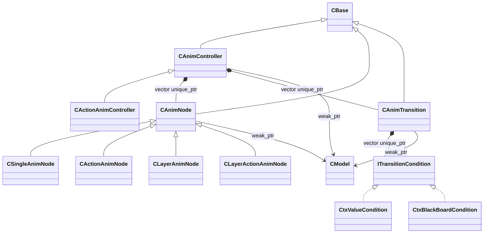

# Animation System

3D Blend Space, Additive Animation, Aim Offset과 다중 레이어 Pose 합성에 사용한 애니메이션 시스템입니다.

## 클래스 구조

`<|--` 상속 · `<|..` 인터페이스 구현 · `*--` 소유 · `-->` 비소유 참조

## 포함 파일

| 구현 단위 | 헤더 | 구현 |
|---|---|---|
| `ActionAnimController` | `Include/ActionAnimController.h` | `Source/ActionAnimController.cpp` |
| `ActionAnimNode` | `Include/ActionAnimNode.h` | `Source/ActionAnimNode.cpp` |
| `Animation` | `Include/Animation.h` | `Source/Animation.cpp` |
| `AnimController` | `Include/AnimController.h` | `Source/AnimController.cpp` |
| `AnimNode` | `Include/AnimNode.h` | `Source/AnimNode.cpp` |
| `AnimTransition` | `Include/AnimTransition.h` | `Source/AnimTransition.cpp` |
| `LayerActionAnimNode` | `Include/LayerActionAnimNode.h` | `Source/LayerActionAnimNode.cpp` |
| `LayerAnimNode` | `Include/LayerAnimNode.h` | `Source/LayerAnimNode.cpp` |
| `SingleAnimNode` | `Include/SingleAnimNode.h` | `Source/SingleAnimNode.cpp` |

> 전체 프로젝트의 빌드 의존성은 포함하지 않았으며, 구현 흐름을 확인하는 데 필요한 범위까지만 선별했습니다.
