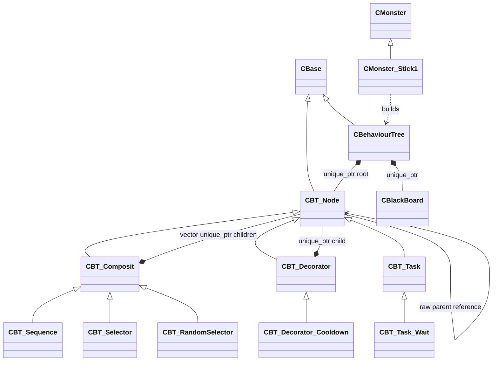

# Behaviour Tree

Composite·Decorator·Task 노드와 공통 Subtree, 실행 상태 전파를 담당하는 행동 트리 시스템입니다.

## 클래스 구조

`<|--` 상속 · `*--` 소유 · `-->` 비소유 참조 · `..>` 의존

## 실행 결과

## 포함 파일

| 구현 단위 | 헤더 | 구현 |
|---|---|---|
| `BehaviourTree` | `Include/BehaviourTree.h` | `Source/BehaviourTree.cpp` |
| `BT_Composit` | `Include/BT_Composit.h` | `Source/BT_Composit.cpp` |
| `BT_Decorator` | `Include/BT_Decorator.h` | `Source/BT_Decorator.cpp` |
| `BT_Decorator_CoolDown` | `Include/BT_Decorator_CoolDown.h` | `Source/BT_Decorator_CoolDown.cpp` |
| `BT_Node` | `Include/BT_Node.h` | `Source/BT_Node.cpp` |
| `BT_RandomSelector` | `Include/BT_RandomSelector.h` | `Source/BT_RandomSelector.cpp` |
| `BT_Selector` | `Include/BT_Selector.h` | `Source/BT_Selector.cpp` |
| `BT_Sequence` | `Include/BT_Sequence.h` | `Source/BT_Sequence.cpp` |
| `BT_Task` | `Include/BT_Task.h` | `Source/BT_Task.cpp` |
| `BT_Task_Wait` | `Include/BT_Task_Wait.h` | `Source/BT_Task_Wait.cpp` |
| `Example/Stick/Monster_Stick1` | `Example/Stick/Include/Monster_Stick1.h` | `Example/Stick/Source/Monster_Stick1.cpp` |

> 전체 프로젝트의 빌드 의존성은 포함하지 않았으며, 구현 흐름을 확인하는 데 필요한 범위까지만 선별했습니다.
