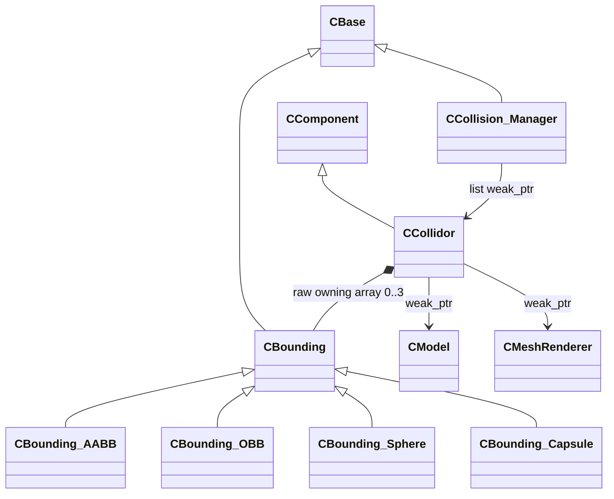

# Collision System

본 기반 캡슐 콜라이더와 매니폴드 연산, 반복 충돌 해소에 사용한 코드입니다.

## 클래스 구조

`<|--` 상속 · `*--` 소유 · `-->` 비소유 참조

## 포함 파일

| 구현 단위 | 헤더 | 구현 |
|---|---|---|
| `Hi-Fi-RUSH/Bounding` | `Hi-Fi-RUSH/Include/Bounding.h` | `Hi-Fi-RUSH/Source/Bounding.cpp` |
| `Hi-Fi-RUSH/Bounding_AABB` | `Hi-Fi-RUSH/Include/Bounding_AABB.h` | `Hi-Fi-RUSH/Source/Bounding_AABB.cpp` |
| `Hi-Fi-RUSH/Bounding_Capsule` | `Hi-Fi-RUSH/Include/Bounding_Capsule.h` | `Hi-Fi-RUSH/Source/Bounding_Capsule.cpp` |
| `Hi-Fi-RUSH/Bounding_OBB` | `Hi-Fi-RUSH/Include/Bounding_OBB.h` | `Hi-Fi-RUSH/Source/Bounding_OBB.cpp` |
| `Hi-Fi-RUSH/Bounding_Sphere` | `Hi-Fi-RUSH/Include/Bounding_Sphere.h` | `Hi-Fi-RUSH/Source/Bounding_Sphere.cpp` |
| `Hi-Fi-RUSH/BoundingCapsule` | `Hi-Fi-RUSH/Include/BoundingCapsule.h` | `Hi-Fi-RUSH/Source/BoundingCapsule.cpp` |
| `Hi-Fi-RUSH/Collidor` | `Hi-Fi-RUSH/Include/Collidor.h` | `Hi-Fi-RUSH/Source/Collidor.cpp` |
| `Hi-Fi-RUSH/Collision_Manager` | `Hi-Fi-RUSH/Include/Collision_Manager.h` | `Hi-Fi-RUSH/Source/Collision_Manager.cpp` |
| `Kena/Bounding` | `Kena/Include/Bounding.h` | `Kena/Source/Bounding.cpp` |
| `Kena/Bounding_AABB` | `Kena/Include/Bounding_AABB.h` | `Kena/Source/Bounding_AABB.cpp` |
| `Kena/Bounding_Capsule` | `Kena/Include/Bounding_Capsule.h` | `Kena/Source/Bounding_Capsule.cpp` |
| `Kena/Bounding_OBB` | `Kena/Include/Bounding_OBB.h` | `Kena/Source/Bounding_OBB.cpp` |
| `Kena/Bounding_Sphere` | `Kena/Include/Bounding_Sphere.h` | `Kena/Source/Bounding_Sphere.cpp` |
| `Kena/BoundingCapsule` | `Kena/Include/BoundingCapsule.h` | `Kena/Source/BoundingCapsule.cpp` |
| `Kena/Collidor` | `Kena/Include/Collidor.h` | `Kena/Source/Collidor.cpp` |
| `Kena/Collision_Manager` | `Kena/Include/Collision_Manager.h` | `Kena/Source/Collision_Manager.cpp` |

> 전체 프로젝트의 빌드 의존성은 포함하지 않았으며, 구현 흐름을 확인하는 데 필요한 범위까지만 선별했습니다.
