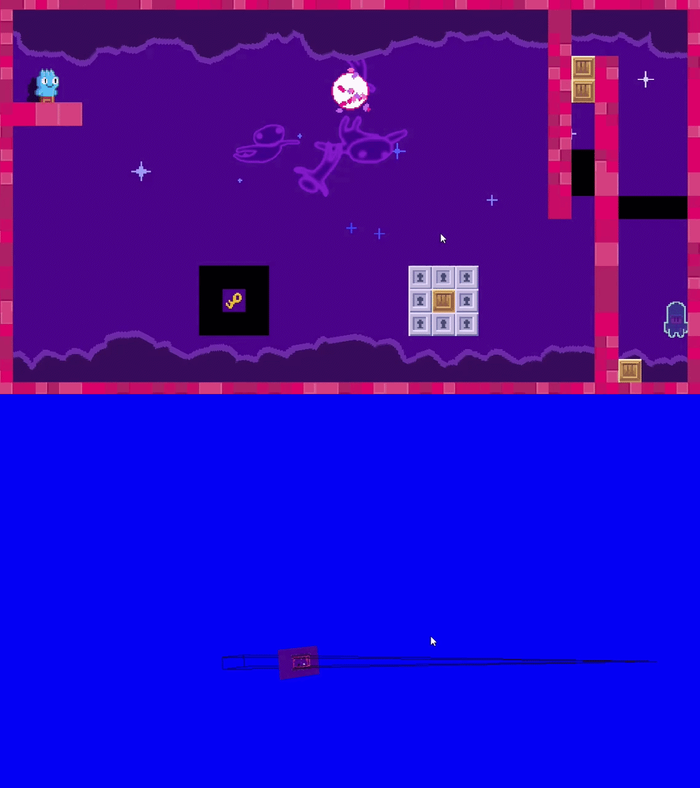

# Hybrid Camera

낮은 FOV와 카메라 거리 계산으로 2D·3D 시점을 전환하는 카메라 코드입니다.

## 실행 결과

### 2D·3D 카메라 전환

## 포함 파일

| 구현 단위 | 헤더 | 구현 |
|---|---|---|
| `BaseCamera` | `Include/BaseCamera.h` | `Source/BaseCamera.cpp` |
| `HybridCamera` | `Include/HybridCamera.h` | `Source/HybridCamera.cpp` |

> 전체 프로젝트의 빌드 의존성은 포함하지 않았으며, 구현 흐름을 확인하는 데 필요한 범위까지만 선별했습니다.
