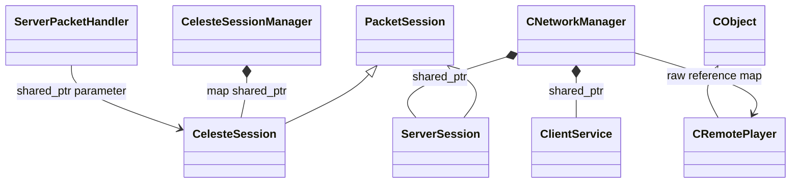
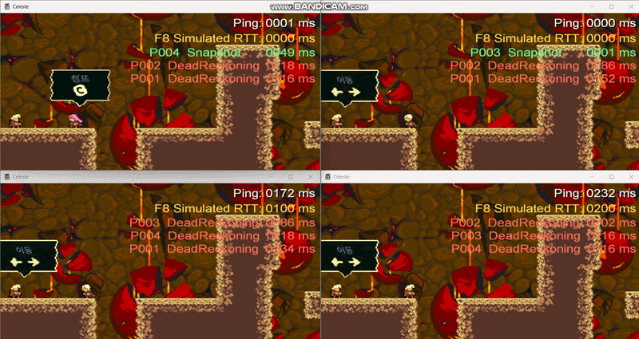

# Network Synchronization

Celeste의 패킷 송수신과 스테이지별 상태 전파, 외부 플레이어 보간 및 데드 레커닝에 직접 작성한 코드입니다.

## 클래스 구조

`<|--` 상속 · `*--` 소유 · `-->` 비소유 사용/참조

> `PacketSession`, `ClientService`, `CObject`는 외부 기반 클래스/의존성으로 구현 코드는 공개 범위에서 제외했습니다.

## 실행 결과

### 지연 환경의 원격 플레이어 보정

## 포함 파일

| 구현 단위 | 헤더 | 구현 |
|---|---|---|
| `Client/NetworkManager` | `Client/Include/NetworkManager.h` | `Client/Source/NetworkManager.cpp` |
| `Client/RemotePlayer` | `Client/Include/RemotePlayer.h` | `Client/Source/RemotePlayer.cpp` |
| `Client/ServerSession` | `Client/Include/ServerSession.h` | `Client/Source/ServerSession.cpp` |
| `Protocol/CelesteProtocol` | `Protocol/Include/CelesteProtocol.h` | — |
| `Protocol/NetworkSettings` | `Protocol/Include/NetworkSettings.h` | — |
| `RelayServer/CelesteSession` | `RelayServer/Include/CelesteSession.h` | `RelayServer/Source/CelesteSession.cpp` |
| `RelayServer/CelesteSessionManager` | `RelayServer/Include/CelesteSessionManager.h` | `RelayServer/Source/CelesteSessionManager.cpp` |
| `RelayServer/ServerPacketHandler` | `RelayServer/Include/ServerPacketHandler.h` | `RelayServer/Source/ServerPacketHandler.cpp` |

> 전체 프로젝트의 빌드 의존성은 포함하지 않았으며, 구현 흐름을 확인하는 데 필요한 범위까지만 선별했습니다.
