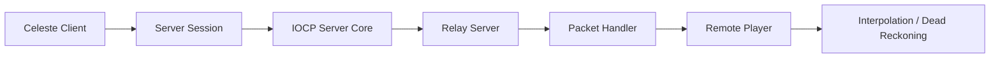

# IOCP Network

IOCP 릴레이 서버와 패킷 처리, 스냅샷 보간 및 데드 레커닝에 사용한 코드입니다.

## 구조

## 포함 파일

| 구현 단위 | 헤더 | 구현 |
|---|---|---|
| `Client/NetworkManager` | `Client/Include/NetworkManager.h` | `Client/Source/NetworkManager.cpp` |
| `Client/RemotePlayer` | `Client/Include/RemotePlayer.h` | `Client/Source/RemotePlayer.cpp` |
| `Client/ServerSession` | `Client/Include/ServerSession.h` | `Client/Source/ServerSession.cpp` |
| `Protocol/CelesteProtocol` | `Protocol/Include/CelesteProtocol.h` | — |
| `Protocol/NetworkSettings` | `Protocol/Include/NetworkSettings.h` | — |
| `RelayServer/CelesteSession` | `RelayServer/Include/CelesteSession.h` | `RelayServer/Source/CelesteSession.cpp` |
| `RelayServer/CelesteSessionManager` | `RelayServer/Include/CelesteSessionManager.h` | `RelayServer/Source/CelesteSessionManager.cpp` |
| `RelayServer/ServerPacketHandler` | `RelayServer/Include/ServerPacketHandler.h` | `RelayServer/Source/ServerPacketHandler.cpp` |
| `ServerCore/BufferReader` | `ServerCore/Include/BufferReader.h` | `ServerCore/Source/BufferReader.cpp` |
| `ServerCore/BufferWriter` | `ServerCore/Include/BufferWriter.h` | `ServerCore/Source/BufferWriter.cpp` |
| `ServerCore/IocpCore` | `ServerCore/Include/IocpCore.h` | `ServerCore/Source/IocpCore.cpp` |
| `ServerCore/IocpEvent` | `ServerCore/Include/IocpEvent.h` | `ServerCore/Source/IocpEvent.cpp` |
| `ServerCore/Listener` | `ServerCore/Include/Listener.h` | `ServerCore/Source/Listener.cpp` |
| `ServerCore/NetAddress` | `ServerCore/Include/NetAddress.h` | `ServerCore/Source/NetAddress.cpp` |
| `ServerCore/RecvBuffer` | `ServerCore/Include/RecvBuffer.h` | `ServerCore/Source/RecvBuffer.cpp` |
| `ServerCore/SendBuffer` | `ServerCore/Include/SendBuffer.h` | `ServerCore/Source/SendBuffer.cpp` |
| `ServerCore/Service` | `ServerCore/Include/Service.h` | `ServerCore/Source/Service.cpp` |
| `ServerCore/Session` | `ServerCore/Include/Session.h` | `ServerCore/Source/Session.cpp` |
| `ServerCore/SocketUtils` | `ServerCore/Include/SocketUtils.h` | `ServerCore/Source/SocketUtils.cpp` |

> 전체 프로젝트의 빌드 의존성은 포함하지 않았으며, 구현 흐름을 확인하는 데 필요한 범위까지만 선별했습니다.
