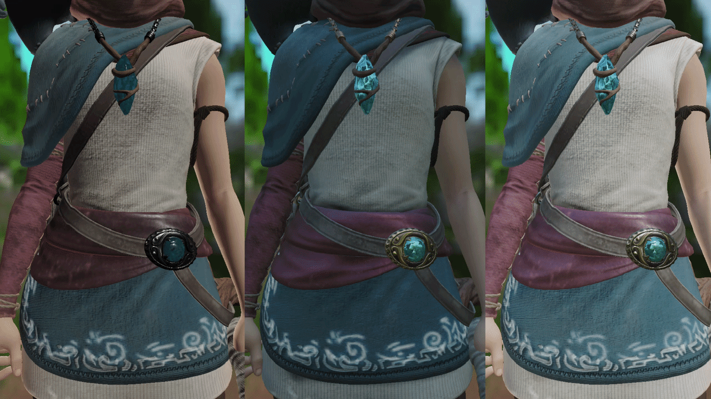

# PBR Rendering

Cook–Torrance BRDF 직접광과 Split-Sum IBL을 구성하는 셰이더입니다.

## 실행 결과

### Shader Ball IBL

### 직접광과 IBL 통합 결과

## 포함 파일

| 구현 단위 | 헤더 | 구현 |
|---|---|---|
| `Shader_Deferred` | — | `Shaders/Shader_Deferred.hlsl` |
| `Shader_Defines` | — | `Shaders/Shader_Defines.hlsli` |
| `Shader_PBR` | — | `Shaders/Shader_PBR.hlsli` |
| `Shader_ScreenSpace` | — | `Shaders/Shader_ScreenSpace.hlsl` |

> 전체 프로젝트의 빌드 의존성은 포함하지 않았으며, 구현 흐름을 확인하는 데 필요한 범위까지만 선별했습니다.
