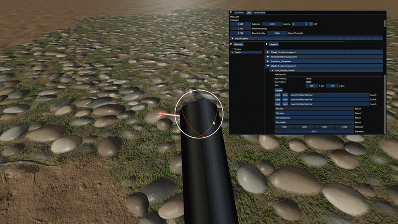

# Terrain Tool

높이 편집 브러시와 PBR Splat Map 페인팅에 사용한 코드와 셰이더입니다.

## 실행 결과

## 포함 파일

| 구현 단위 | 헤더 | 구현 |
|---|---|---|
| `Shader_PBR` | — | `Shaders/Shader_PBR.hlsli` |
| `Shader_Terrain` | — | `Shaders/Shader_Terrain.hlsl` |
| `TerrainRenderer` | `Include/TerrainRenderer.h` | `Source/TerrainRenderer.cpp` |
| `VIBuffer_Terrain` | `Include/VIBuffer_Terrain.h` | `Source/VIBuffer_Terrain.cpp` |

> 전체 프로젝트의 빌드 의존성은 포함하지 않았으며, 구현 흐름을 확인하는 데 필요한 범위까지만 선별했습니다.
